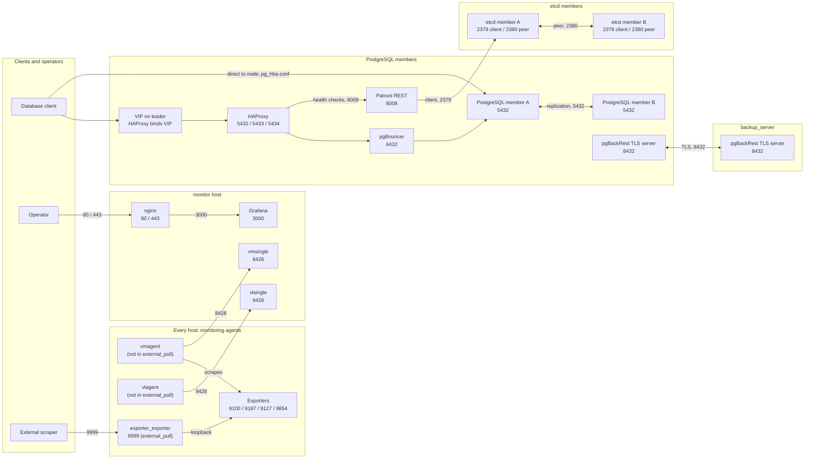

# Ports

This reference maps pigsty-lite listeners to their owning roles, bind addresses, firewall reachability, SELinux labels, and Ansible variables. Host groups are `postgres` (PostgreSQL members), `etcd`, `monitor`, and `backup_server`; “any” means any source admitted by the zone-wide firewalld service.

| Port | Proto | Process (role) | Binds | Firewall: who may connect | SELinux | Variable |
| --- | --- | --- | --- | --- | --- | --- |
| 22 | tcp | sshd (`node`) | all | any (baseline service `ssh`) | `ssh_port_t` | `node_firewalld_baseline_services` (default `[ssh]`; port is from the `ssh` service) |
| 80, 443 | tcp | nginx reverse proxy for Grafana/Alertmanager/vmalert (`nginx_proxy`, `monitor` host) | `network_any_address` | `operator_cidrs` only (`443` when TLS is enabled) | `httpd_t` (`http_port_t`) | `nginx_proxy_http_port`, `nginx_proxy_https_port` |
| 2379 | tcp | etcd client (`etcd`) | `network_any_address` | `etcd` and `postgres` hosts (rich rules) | unconfined | `etcd_client_port` |
| 2380 | tcp | etcd peer (`etcd`) | `network_any_address` | other `etcd` hosts | unconfined | `etcd_peer_port` |
| 3000 | tcp | Grafana (`grafana`) | loopback | none (reached through `nginx_proxy`) | unconfined | `grafana_default_port` |
| 5432 | tcp | PostgreSQL (`patroni`) | node address and loopback | `postgres_client_cidrs` (service `postgresql` rich rules); other cluster members via roles/patroni's replication rule | unconfined (child of Patroni) | `postgres_port` |
| 5432 | tcp | HAProxy default frontend → leader (`haproxy`) | `127.0.0.2` and VIP when `vip_manager` is enabled | `postgres_client_cidrs` (service `postgresql` rich rules); other cluster members via roles/patroni's replication rule | `haproxy_t`; requires `haproxy_connect_any` | `haproxy_default_port` |
| 5433 | tcp | HAProxy primary (RW) frontend (`haproxy`) | `127.0.0.2` and VIP when `vip_manager` is enabled | `postgres_client_cidrs` (service `haproxy-postgres` rich rules); outside access only via the VIP (HAProxy binds 127.0.0.2 and the VIP) | `haproxy_t`; requires `haproxy_connect_any` | `haproxy_primary_port` |
| 5434 | tcp | HAProxy replica (RO) frontend (`haproxy`) | `127.0.0.2` and VIP when `vip_manager` is enabled | `postgres_client_cidrs` (service `haproxy-postgres` rich rules); outside access only via the VIP (HAProxy binds 127.0.0.2 and the VIP) | `haproxy_t`; requires `haproxy_connect_any` | `haproxy_replica_port` |
| 6432 | tcp | pgBouncer (`pgbouncer`) | `network_any_address` | every `postgres` member, including itself (HAProxy backend rich rules); `postgres_client_cidrs` only when `pgbouncer_firewalld_enabled` | unconfined | `pgbouncer_listen_port` (HAProxy backend: `haproxy_backend_port`) |
| 7000 | tcp | HAProxy stats (`haproxy`) | loopback | none (loopback) | `haproxy_t`; requires `haproxy_connect_any` | `haproxy_stats_port` |
| 8008 | tcp | Patroni REST (`patroni`) | `network_any_address` | any (service `patroni-rest`) | unconfined | `patroni_rest_port` |
| 8428 | tcp | VictoriaMetrics vmsingle (`monitoring_server`, `monitor` host) | `network_any_address` | `postgres` and `monitor` hosts | unconfined | `vmsingle_port` |
| 8429 | tcp | vmagent (`monitoring_agents`) | loopback | none | unconfined | `vmagent_port` |
| 8432 | tcp | pgBackRest TLS server (`pgbackrest`) | all (`tls-server-address=*`) | `backup_server` ↔ `postgres` hosts (server mode admits `postgres` hosts; client mode admits `backup_server`); not opened in local mode (AIO) | unconfined | `pgbackrest_tls_port` |
| 8880 | tcp | vmalert (`monitoring_server`) | loopback | none | unconfined | `vmalert_port` |
| 9093 | tcp | Alertmanager (`monitoring_server`) | loopback | none | unconfined | `alertmanager_port` |
| 9100 | tcp | node_exporter (`monitoring_agents`, every host) | self-hosted: `network_any_address`; external modes: loopback | self-hosted: monitor host only; external modes: none | unconfined | `node_exporter_port` |
| 9187 / 9127 / 9854 | tcp | postgres_exporter / pgbouncer_exporter / pgbackrest_exporter (`monitoring_agents`, `postgres` hosts) | same as 9100 | same as 9100 | unconfined | `postgres_exporter_port`, `pgbouncer_exporter_port`, `pgbackrest_exporter_port` |
| 9428 | tcp | VictoriaLogs vlsingle (`monitoring_server`) | `network_any_address` | `postgres` and `monitor` hosts | unconfined | `vlsingle_port` |
| 9429 | tcp | vlagent (`monitoring_agents`) | loopback | none | unconfined | `vlagent_port` |
| 9999 | tcp | exporter_exporter, `external_pull` only (`monitoring_agents`) | `network_any_address`, TLS by default, bearer token | `monitoring.external_pull.source_cidrs` | unconfined | `monitoring_pull_metrics_port` |

## Client access

With a VIP, clients in `firewall.postgres_client_cidrs` can connect to
`VIP:5432` for the leader, `VIP:5433` for RW, or `VIP:5434` for RO. Without
a VIP, HAProxy is local-only on `127.0.0.2`; remote clients can connect
directly to the leader node's PostgreSQL on port 5432 if their source is in
`firewall.postgres_client_cidrs`, subject to `pg_hba.conf`. On a node, the HAProxy frontends are
available at `127.0.0.2:5432`, `:5433`, and `:5434`. `vip-manager` listens
on nothing; it moves the VIP to the leader.

## SELinux

HAProxy can bind 5432 (`postgresql_port_t`), 5433/5434 (`unreserved_port_t`),
and 7000 (`gatekeeper_port_t`) because the `haproxy` role enables the
`haproxy_connect_any` boolean; otherwise `haproxy_t` may bind only
`http_port_t`-like types. Only HAProxy (`haproxy_t`) and nginx (`httpd_t`)
are SELinux-confined; everything else runs as `unconfined_service_t`.

## Firewall scope

Client ports admit only `firewall.postgres_client_cidrs`; direct pgBouncer
access also requires `pgbouncer_firewalld_enabled`. Intra-cluster ports
(2379/2380, 8432, 6432 backends, and 5432 replication) keep their
member-scoped rules. Patroni REST on 8008 remains zone-wide. `pg_hba.conf`
(`postgres.hba_rules`) still decides which users and databases a client may
use. “Any” in the table means any source allowed by the zone-wide firewalld
service; peer-specific rules are restricted to the listed host groups.

The roles do not manage the zone's pre-existing services. A stock EL10
`public` zone also allows `cockpit` (9090) and `dhcpv6-client`; remove them
by hand if the host does not need them.

When the only source for an intra-cluster firewall rule is the service's own
host, the rule is omitted because traffic to the host's own address uses
loopback. This applies to etcd peer/client, monitoring-server, and
node_exporter rules; the service bindings are unchanged. Patroni REST (8008)
is opened only when `postgres` has more than one member.
